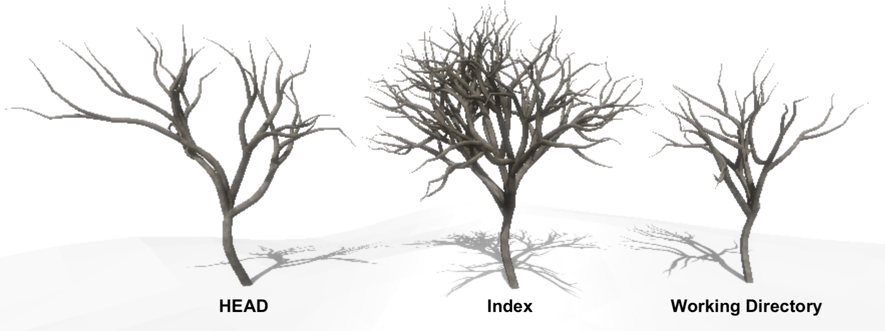
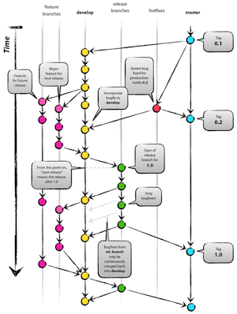

# Basics 

A basic workshop to learn the world of git

Note:
Everyone needs to have the following things before we start the class
* git 
* github account
* Node and NPM

---

### What is git?

- Short history
- Alternatives (SVN, Mercurial, etc)
- Distributed version control

Note:
* Short history. Git and Linus Torvalds
* SVN and Mercurial

----

Centralized Version Control


Local Version Control


Note:
* Mention the idea of working with other people through the network. 

----

Distributed vesion control system
 
It looks something like this 


Note:


---

## Let's do some coding

---

### Configuration

```bash
git init test
cd test

git config --local user.name andres
git config --local user.email andres.jorquera@kairosds.com

ls .git
HEAD    config    description    hooks    info    objects    refs
```

Note: 
* Talk about why configuring email and name is important
* Mention where git stores its data. "." means hidding directory in unix

----

### States

```
echo "Hello" >> README.md
git add README.md
git commit -m "my commit message" 
```


---

### First commits

1. Create the following files: README.md

2. Stage files 

	```bash
	git status
	git add README.md
	git status
	```

3. Commit

	```bash
	git commit -m 'Here goes my message'
	git status
	```

4. Add your name to README.md and commit

Note:
* Explain the utility of both files. 
* A possible message could be, your name and a description about yourself

----

We have something like...


Note:
* Mention the arrows

---

### Branching and merging

1. Create a new branch

	```
	git branch
	git checkout -b feat/tests
	git branch
	```

2. Create a simple test in test/basic.js and commit

	```javascript
	const assert = require('assert');

	describe('git basics challenge', ()=> {
		it('should return the must basic test of all', () => {
			assert(true);
		});
	});
	```

Note:
* Talk a little bit about test in software

----

3. Go back to master and do a bit of work...

	```bash
	git checkout master
	git branch
	
	#working...

	git commit -m 'More commits'
	```

4. Merge test branch

	```
	git branch
	git merge feat/test
	```
Note: 
* Talk about how the files disappear 
* Do a list of things you like

* We want the work we did in the other branch
* Check the recursive strategy

----

This is what we have done...


Note: 
* Introducing branch and HEAD in graph
* Show an interactive procedure of what we have done. (link)[https://learngitbranching.js.org/]

----

### Merge Strategies

Fast forward


Recursive strategy


Note:

---

### Remotes

1. Go to this [link](https://github.com/ajorquera/git-workshop) and fork it

2. Add the remote from the new repo

	```bash
	git remote add origin git@github.com:${username}/git-workshop.git
	git remote -v
	```
3. Change branch to assignments/commiting-branching

4. Push
	```bash
	git push
	git push --set-upstream origin master
	git fetch
	git merge origin/master
	git push
	```

Note: 
* Talk about git pull ---> git fetch && git merge
----

4. Merge more tests from origin/feat/more-tests
	```bash
	git branch 
	git branch -a
	git merge origin/feat/more-tests
	git push
	```

Note:
* show the repo before and after pushing
* show animation of what we have done
* Explain pull vs fetch

----

#### Git hosting

- Github 
- Bitbucket 
- Gitlab
- Microsoft Visual Studio Team Services

---

### Merge Conflicts
	
1. Merge branch feat/conflicts-watch-out
  
	```bash
	git merge feat/conflicts-watch-out
	git status
	```

Note: 

----

### Conflicts - File modified


```bash
#open file with an editor
nano README.md
git add README.md
git status
```

----

### Conflicts - File deleted

```bash
git rm garbage.txt
git status
git commit
```

----

#### Tools for resolving conflicts

- Text editors
- IDE
- Applications

Note:
* Talk about meld
---

### Tagging 

- Lightweigh

	```bash
	git tag 1.0.0
	```

- Annotated
	```bash
	git tag -a 1.0.1 -m 'My annotated tag 1.0.1'
	git push --tags 
	```

Note: 
Maybe we could talk about NPM version and version control

---

### Visualizing git

* IDE plugins
* Web Interfaces
* Applications
* Git


```
git config --local alias.lg "log --graph --abbrev-commit --decorate --format=format:'%C(bold blue)%h%C(reset) - %C(bold green)(%ar)%C(reset) %C(white)%s%C(reset) %C(dim white)- %an%C(reset)%C(auto)%d%C(reset)' --all"
```

Note: 
* Check github account for our new commits and tags and network

---

## Save our work

Git was made thinking on collaboration. So, everyone, lets work in a branch to merge our work.

1. I'll add you as a collaborator in a project 

2. Push your work to a branch I have just created for this class

3. Work with your classmates and resolve all conflicts.

We should have something like:

```
# Class 21/9/2018 A.K.A The avengers

## Name student A
... 
...

## Name student B
...
...
```

---

## Part 2

---

## Core Basics

----

### Merge Strategies

Fast forward


Recursive strategy


Note:
* https://learngitbranching.js.org/

----

### Snapshots

This is the most simplified git you have seen:


But, how about we go deeper...

Note:
Talk about the meaning of snapshots. 

----

#### Integrity

Cryptographic hash function SHA-1

```
shasum README.md
dd122581c8cd44d0227f9c305581ffcb4b6f1b46 README.md

echo " " >> README.md

shasum README.md
da39a3ee5e6b4b0d3255bfef95601890afd80709 README.md
```

----

### References 

Branches, HEAD, tags, remotes


 Note: 
 * Explain HEAD => branch => commit

----

#### Database - commit, tree, tag and blob


Note: 
* tag objects
* a commit has a reference to a parent unless is the initial commit
* show in .git/objects dir

---

## The Tree Threes



----

Again this....


Note: 
* Make note about the meaning of each three
* Mention the confusion about checkout and reset

----

## Git reset

* Reset --soft
* Reset --mixed (default)
* Reset --hard
* Reset file

Note: 
* hard is dangerous, destroys data
* Watch out with changing history

----
### Usability Examples

* Someone force pushed a common branch
* I want to see on my editor what changes are in a commit(s)
* Squashing commits
* Unstage files
* Recycle a branch
* [Assignments](https://github.com/ajorquera/git-workshop/wiki/assignments%3A-reset)

---

## Git checkout

* Checkout branches
* Checkout commits
* Checkout tags
* Checkout files 

----

### Usability examples
* Change branches
* Go back in time
* Restore files
* Get file versions from other branches
* [Assignments](https://github.com/ajorquera/git-workshop/wiki/assignments%3A-checkout)

Note: 
* Detached HEAD
* What would happend if I commit in detached HEAD
* Think of an interactive way of showing HEAD changing

----
### Travel in time

1. Clone project https://github.com/git/git
2. Go back in time and checkout their first version
3. Lets see why working in detached head is dangerous
   * Once you checkout a tag version, make a commit, setting your name in the README.md
   * Go to master branch
   * <details>
	   <summary>
		  Don't click until you have done the previous steps
	   </summary>
	   Try to go back to your previous commit. Ja! Good luck
	 </details>

---


## Reset vs Checkout

Note: 
* A lot of confusion with them
* Some cases you can use them interchangable. git checkout path = git reset --hard path

---

## Git stash
* Simple
* Stash utils (save, list, apply, clear)
* Interactive `stash -p`
* Creating branch

Note: 
* Some people doesn't recommend stashing because you could forget and loose information
* Show examples in terminal
* Stashing could bring conflicts

---

## Rebase
> With great power comes great responsibility. Uncle Ben

* Rebase branch 
* Rebase interactive
* Changing history

*[Assignments](https://github.com/ajorquera/git-workshop/wiki/assignments%3A-rebase)* 

Note: 
* Show interactive way of rebase
---

## Rebase vs Merge
* Rebase can be dangeoures, because push -f
* Rebase creates a cleaner history
* Whatever you choose, be consistent as a team

Note:
* Go to a project, where merge is the default, and check number of merges compared to total count of commits.
`git rev-list --all --merges --count` and `git rev-list --all --count`
---

## Workflows

* Master only
* Feature branching
* Succesful git workflow
* Github workflow / Forking workflow

Note: 
* [github flow](https://guides.github.com/introduction/flow/)

----

### Master only


----

### Feature Branching


Note: 
* [Atlassian explanation](https://www.atlassian.com/git/tutorials/comparing-workflows/feature-branch-workflow)
* github uses feature branch. [More info](http://scottchacon.com/2011/08/31/github-flow.html)

----

### Successfull git workflow



Note: 
[More info](https://nvie.com/posts/a-successful-git-branching-model/)


----

### Github workflow

[Click me](https://guides.github.com/introduction/flow/)


---

## Useful commands
* Git alias. [Examples](https://gist.github.com/ajorquera/24d037556ebf84c07c07f420eecc047b)
* Git blame or github blame
* Git log (lg)
* git reflog

Note:
Show some examples in the terminal

----

### Git alias
* p, pf
* new, publish
* rh, r1, r2, r3
* pick
* amend

----

### Git log, reflog
* Search 
* Fancy stuff
* Lost reference

Note:
* Somehitng

---

## Documentation
* Pro Git (Digital version is free on amazon)
* Awesome list. [More info...](https://github.com/sindresorhus/awesome)
* [Git website](https://git-scm.com/)
* [Youtube](https://www.youtube.com/results?search_query=learn+git)
